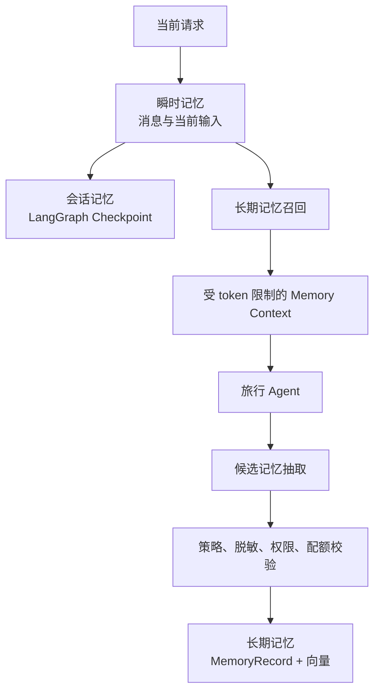

# 企业级多租户 Agent Memory 设计

> 本文定义 TravelAssistant 的长期记忆、会话状态和瞬时上下文设计。目标是补齐当前“按 user_id 保存用户画像”的 Demo 能力，使记忆具备租户隔离、RBAC、审计、生命周期、配额和可删除能力。
>
> 与 [architecture.md](architecture.md) 的关系：`architecture.md` 保留为现有系统架构说明；本文只负责 Memory 的详细设计和迁移约束。

## 1. 设计目标与边界

### 1.1 目标

- 租户之间严格隔离，任何读取、写入、更新、删除都必须绑定 `tenant_id`。
- 用户、团队、Agent、租户级记忆具有明确可见范围。
- Checkpoint、会话消息和长期记忆职责分离。
- 记忆写入受租户策略、敏感信息检测和配额控制。
- 记忆读取可审计，软删除和自动过期可追踪。
- 记忆服务失败时不阻断普通旅行规划流程。
- 记忆召回有明确的 TopK、token 预算和过滤规则。

### 1.2 非目标

第一阶段不实现以下能力：

- 不把全部对话自动写入长期记忆。
- 不把图片、音频或大型工具结果放入长期记忆。
- 不在 Checkpoint 中代替长期记忆保存用户画像。
- 不在应用层之外暴露绕过租户过滤的底层查询接口。
- 不在 MVP 阶段实现复杂的跨租户知识共享。

## 2. 三层记忆模型



### 2.1 瞬时记忆

载体：`TravelState.messages` 和当前请求上下文。

保存内容：

- 当前轮文本。
- 音频转写结果。
- 图片 OCR 和语义理解结果。
- 尚未确认的候选约束。
- 当前节点需要的临时变量。

规则：

- 不自动成为长期记忆。
- 图片推测内容在用户确认前只能放在候选字段。
- 内容过长时通过摘要或滑动窗口控制上下文。

### 2.2 会话记忆

载体：LangGraph Checkpoint，必要时使用 Redis 热缓存和 PostgreSQL 持久化。

用途：

- 保存 `current_step` 和旅行规划状态。
- 支持会话恢复、人工确认和步骤回退。
- 保存当前任务的工具中间结果和审批状态。

必须绑定：

```text
tenant_id + conversation_id + thread_id
```

Checkpoint 不保存：

- 长期用户偏好。
- 原始媒体二进制。
- 无限制的完整外部响应。
- 访问令牌、密码和其他敏感信息。

### 2.3 长期记忆

载体：PostgreSQL 结构化元数据 + pgvector 或独立 Memory Collection。

用途：

- 跨会话复用用户明确表达的偏好。
- 保存已确认的旅行事实和历史经验。
- 保存租户或 Agent 级业务规则。

长期记忆必须经过抽取、校验和写入服务，Agent 不应直接任意写入向量库。

## 3. 身份与租户隔离

### 3.1 TenantContext

所有 Memory Service 的公开方法必须接收可信的上下文对象，而不能只接收一个 `user_id`。

```python
class TenantContext(BaseModel):
    tenant_id: UUID
    user_id: UUID
    agent_id: str
    roles: set[str]
    team_ids: set[str] = Field(default_factory=set)
```

上下文来源：

```text
JWT sub
  -> 查询用户租户成员关系
  -> 查询角色和团队
  -> 校验 Agent 访问权限
  -> 构造 TenantContext
```

客户端提交的 `tenant_id`、`user_id`、`roles` 不能覆盖服务端上下文。

### 3.2 数据模型

新增或扩展以下实体：

```text
tenant
  id, name, status, settings, created_at, deleted_at

tenant_member
  tenant_id, user_id, role, team_id, status, created_at

conversation
  tenant_id, user_id, agent_id, ...

memory_record
  tenant_id, agent_id, user_id, team_id, ...
```

当前 User 模型没有租户归属，迁移期可以增加 `default_tenant_id`，但多租户正式实现应以 `tenant_member` 为权威关系表。

### 3.3 强制隔离规则

所有记忆操作必须满足：

```text
tenant_id = current_tenant
AND is_deleted = false
AND expire_at IS NULL OR expire_at > now()
AND rbac_scope 对当前用户可见
```

向量检索也必须携带同等 metadata filter，不能只在结果返回后再过滤。

建议使用三层防护：

1. Repository 方法强制接收 `TenantContext`。
2. PostgreSQL 使用租户列索引和 Row-Level Security。
3. 自动化测试覆盖跨租户、跨用户和跨 Agent 访问。

## 4. MemoryRecord 标准结构

```python
class MemoryRecord(BaseModel):
    memory_id: UUID
    tenant_id: UUID
    agent_id: str
    user_id: UUID | None = None
    team_id: str | None = None
    content: str
    memory_type: Literal["fact", "preference", "experience", "workflow"]
    rbac_scope: Literal["user", "agent", "team", "tenant"]
    importance: float = Field(ge=0.0, le=1.0)
    access_count: int = 0
    last_access_at: datetime | None = None
    expire_at: datetime | None = None
    source: Literal["chat", "reflection", "tool_result", "human"]
    created_by: Literal["agent", "human"]
    is_deleted: bool = False
    conflict_status: Literal["none", "pending", "confirmed"] = "none"
    version: int = 1
    created_at: datetime
    updated_at: datetime
```

建议数据库表增加：

- `embedding`：pgvector 向量字段或独立向量库引用。
- `metadata`：保留来源、标签、模型版本等扩展字段。
- `deleted_at`：软删除时间。
- `retention_reason`：过期或合规删除原因。

## 5. RBAC 可见范围

| `rbac_scope` | 可见范围 | 典型内容 |
| --- | --- | --- |
| `user` | 当前用户 | 饮食禁忌、个人预算、已确认偏好 |
| `agent` | 当前租户内指定 Agent | Agent 业务规则、推荐策略 |
| `team` | 当前租户指定团队 | 团队出差规范、团队常用目的地 |
| `tenant` | 当前租户授权用户 | 租户公共旅行政策 |

角色规则：

| 能力 | 普通用户 | 团队成员 | 租户管理员 |
| --- | ---: | ---: | ---: |
| 读取自己的 `user` 记忆 | 是 | 是 | 是 |
| 写入自己的 `user` 记忆 | 是 | 是 | 是 |
| 读取 `team` 记忆 | 否 | 是 | 是 |
| 管理其他用户记忆 | 否 | 否 | 是 |
| 修改租户记忆策略 | 否 | 否 | 是 |
| 导出租户记忆 | 否 | 否 | 是 |
| 删除租户数据 | 否 | 否 | 是 |

## 6. 召回流水线

```text
当前用户输入
  -> 构造 query
  -> query embedding
  -> tenant_id 强制过滤
  -> rbac_scope 权限过滤
  -> is_deleted / expire_at 过滤
  -> TopK 召回
  -> relevance + importance + freshness 重排
  -> token 预算截断
  -> 更新访问统计
  -> 注入 Agent Context
```

推荐默认值：

```text
TopK: 3-5
Memory prompt token limit: 800-1200
低相关记忆：不注入
过期记忆：不召回
软删除记忆：不召回
```

记忆排序可以使用：

```text
score = relevance * 0.6 + importance * 0.25 + freshness * 0.15
```

长期可加入可配置衰减：

```text
score = importance * exp(-k * delta_days) * log(access_count + 1)
```

召回失败时：

- 记录错误日志和审计事件。
- 当前请求以无长期记忆模式继续执行。
- 不因为 Memory 服务暂时不可用而中断普通查询。

## 7. 记忆写入流水线

```text
任务完成或用户明确确认
  -> MemoryExtractor
  -> 结构化候选记忆
  -> 敏感信息和黑名单检查
  -> 租户开关检查
  -> RBAC scope 校验
  -> 数量和 embedding 配额检查
  -> 冲突检测
  -> 写入 MemoryRecord
  -> 写 MemoryAuditLog
```

写入原则：

- 用户明确表达的内容优先级高于模型推断。
- 图片语义推测在确认前不能写入长期记忆。
- ASR 低置信度内容不能自动写入关键偏好。
- 同一事实更新应生成新版本，旧版本保留审计信息。
- 写入失败不应回滚已完成的旅行规划结果。

## 8. 租户策略、配额与合规

```python
class TenantMemoryPolicy(BaseModel):
    enable_memory: bool = True
    memory_max_count: int = 10000
    memory_retention_days: int = 365
    memory_top_k: int = 5
    memory_prompt_token_limit: int = 1200
    embedding_daily_limit: int = 10000
    recall_qps_limit: int = 100
    memory_blacklist: list[str] = Field(default_factory=list)
    decay_k: float = 0.01
```

必须支持：

- 租户关闭长期记忆。
- 记忆条目数量上限。
- embedding 调用额度。
- 召回 QPS 限制。
- Prompt 记忆 token 上限。
- 字段或关键词黑名单。
- 默认保留天数和自动过期。

敏感数据默认禁止写入：

```text
密码、API Key、访问令牌、银行卡号、身份证号、完整手机号、支付信息
```

## 9. 生命周期、删除与审计

### 9.1 生命周期

```text
active -> expired -> soft_deleted -> purged
```

- 到期先标记为 `is_deleted = true`。
- 向量和正文异步清理。
- 低分记忆可以归档到冷存储。
- 软删除记录保留审计信息。

### 9.2 审计日志

新增 `memory_audit_log`：

```text
id
tenant_id
user_id
agent_id
memory_id
operation: create/read/update/delete/export
result: success/denied/failed
reason
created_at
request_id
```

审计日志不能记录完整敏感内容，只记录摘要、字段名和结果。

### 9.3 租户数据擦除

租户注销或合规删除时，必须清理：

1. Conversation 和 Message。
2. LangGraph checkpoint。
3. MediaAsset 和对象存储文件。
4. MemoryRecord 和向量。
5. RAG 中属于该租户的私有文档。
6. 相关缓存和异步任务。

该操作应提供幂等任务、进度记录和管理员审计结果。

## 10. 服务与目录设计

```text
app/memory/
  __init__.py
  context.py       # TenantContext 构造和校验
  schemas.py       # MemoryRecord、Policy、Audit schema
  policies.py      # 租户策略和 RBAC 判断
  repository.py    # 只接受 TenantContext 的持久化接口
  recall.py        # 过滤、向量召回、重排、token 限制
  extractor.py     # 对话到候选记忆
  writer.py        # 脱敏、配额、冲突、写入
  lifecycle.py     # 过期、归档、软删除、清理
  quota.py         # 计数、embedding、QPS 和 token 配额
  audit.py         # 记忆操作审计
```

当前 `app/core/store.py` 的 `UserMemoryService` 作为兼容层保留，逐步迁移到以上服务。迁移完成后，禁止新代码继续调用只接收 `user_id` 的记忆方法。

## 11. Agent 集成

主图建议增加：

```text
load_tenant_context
  -> load_checkpoint
  -> recall_long_term_memory
  -> execute_current_step
  -> extract_candidate_memories
  -> write_memories
```

`TravelState` 增加：

```python
input_artifacts: NotRequired[list[dict[str, Any]]]
normalized_user_input: NotRequired[str]
input_interpretation: NotRequired[dict[str, Any]]
candidate_constraints: NotRequired[dict[str, Any]]
memory_context: NotRequired[list[dict[str, Any]]]
needs_user_confirmation: NotRequired[bool]
```

`memory_context` 只保存本轮已过滤、已截断的召回结果，不能代替长期存储。

## 12. 迁移计划

### MVP

1. 新增 Tenant、TenantMember 和 TenantContext。
2. Conversation、Message、Checkpoint 增加租户绑定。
3. 新增 `memory_record` 和 `memory_audit_log`。
4. 实现 `user` / `agent` 两级 scope。
5. 所有查询强制过滤 `tenant_id`。
6. 实现长期记忆开关、保留期限、软删除和基础配额。
7. 保留 `UserProfile` / `TravelHistory` 兼容读取。

### V2

1. `team` / `tenant` scope。
2. PostgreSQL RLS 和 pgvector。
3. 记忆衰减、访问统计和归档。
4. 版本、冲突检测和人工编辑。
5. 记忆管理和审计后台。
6. 租户数据导入、导出和擦除。

## 13. 验收标准

### 安全

- 跨租户记忆读取成功率为 0。
- 普通用户不能读取其他用户的 `user` scope 记忆。
- 已删除和已过期记忆不能被召回。
- 所有拒绝访问均产生审计事件。

### 功能

- 同一用户跨会话可以召回已确认偏好。
- 图片推测内容在确认前不会写入长期记忆。
- 租户关闭 Memory 后，Agent 仍可正常完成旅行规划。
- 记忆达到配额后，主流程仍能继续，只返回可观测警告。

### 性能和合规

- Memory prompt 有固定 token 上限。
- 召回、写入和 embedding 调用有租户级指标。
- 租户数据擦除任务可重试、可审计、可验证。
- 记忆服务异常不会拖垮核心 Agent 流程。
