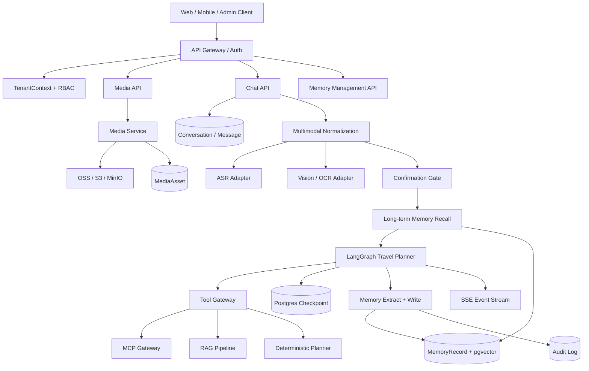

# TravelAssistant 目标架构

> 本文是基于 [architecture.md](architecture.md) 的增量架构设计，保留现有文档作为当前实现说明。本文描述加入多模态输入、企业级多租户 Memory、权限、审计和生命周期治理后的目标形态。
>
> 文件名沿用项目当前约定的 `archetecture` 拼写；正式引用时请以本文路径为准。

## 1. 架构目标

TravelAssistant 从“文本对话驱动的旅行 Agent”升级为：

- 支持文本、语音和图片输入。
- 语音先转写，再沿用正常 Agent 流程。
- 图片作为参考材料，与用户文字联合理解。
- 只有图片时，系统可以提出推测，但必须向用户确认。
- 旅行规划仍由显式 LangGraph 工作流控制。
- 记忆按租户、用户、Agent、团队和角色严格隔离。
- Checkpoint、会话消息和长期记忆职责清晰分离。
- 媒体、工具、记忆和 Agent 调用都可审计、限流和降级。

## 2. 总体架构



## 3. 分层职责

### 3.1 Client 层

负责：

- 文本消息输入。
- 图片和音频选择、上传进度展示。
- 展示媒体处理状态。
- 展示图片解释和用户确认卡片。
- 展示行程、预算、地图和审批事件。

客户端不负责决定 `tenant_id`、`user_id` 或权限范围。

### 3.2 API 与身份层

位置：

```text
app/api/
app/api/dependencies.py
app/api/v1/
```

职责：

- JWT 验证。
- 查询租户成员关系和角色。
- 构造可信 `TenantContext`。
- 校验会话、媒体和记忆资源归属。
- 统一处理限流、请求 ID 和错误格式。

所有业务服务接收服务端构造的 `TenantContext`，不信任请求体中的身份字段。

### 3.3 Media 层

新增目录：

```text
app/media/
  models.py
  schemas.py
  storage.py
  service.py
  processors/
    audio.py
    image.py
```

职责：

- 上传、类型校验、大小限制和病毒扫描。
- 对象存储读写。
- 媒体资源生命周期和删除。
- 音频 ASR。
- 图片 OCR、视觉语义解读和实体抽取。

媒体本体不进入 Agent state、数据库 JSON 或 Checkpoint，只保存 `asset_id` 和处理结果引用。

### 3.4 Message 层

当前 `Message.content` 是单一文本字段。目标协议支持：

```python
class MediaReference(BaseModel):
    asset_id: str
    media_type: Literal["image", "audio"]
    mime_type: str
    filename: str | None = None
    size: int | None = None


class MessageCreate(BaseModel):
    content: str | None = None
    attachments: list[MediaReference] = Field(default_factory=list)
```

建议新增 `message_part`，表达文本、图片、音频和转写结果的顺序关系。原始文件通过 `MediaAsset` 关联。

## 4. 多模态输入链路

### 4.1 语音输入

```text
上传音频
  -> MediaAsset
  -> ASR
  -> transcript
  -> 与用户文本合并
  -> HumanMessage
  -> 正常 TravelState / LangGraph 流程
```

保存以下信息：

- `asset_id`
- 转写文本。
- 语言。
- 音频时长。
- 分段时间戳。
- ASR 置信度。
- 处理模型和版本。

低置信度转写只能作为候选输入；日期、人数、预算等关键约束需要通过正常需求确认流程确认。

### 4.2 图片输入

```text
上传图片
  -> OCR
  -> 视觉描述
  -> 实体 / 旅行约束候选
  -> 与用户文字联合理解
  -> 事实与推测分离
  -> 必要时请求确认
```

#### 同时提供文字和图片

- 文字是主要意图来源。
- 图片是参考材料。
- 图片可以补充风格、地点、菜单、票据或酒店信息。
- 图片信息不能无条件覆盖用户明确文字。

#### 只有图片

系统可以进行语义推测，但必须输出：

```text
观察到的内容
可能的含义
不确定点
需要用户确认的问题
```

图片推测在确认前只能进入：

```text
candidate_constraints
input_interpretation
needs_user_confirmation = true
```

不能直接：

- 写入 `user_requirement`。
- 触发高风险工具。
- 写入长期 Memory。
- 覆盖已经确认的用户事实。

## 5. Agent 与 LangGraph

### 5.1 目标执行链路

```text
请求进入
  ↓
load_tenant_context
  ↓
load_or_validate_conversation
  ↓
process_multimodal_input
  ↓
normalize_user_intent
  ↓
recall_long_term_memory
  ↓
confirmation_gate
  ├─ 需要确认：发送 confirmation_required 并结束本轮
  └─ 无需确认：继续当前 planning step
  ↓
route_current_step
  ↓
step agent + scoped tools
  ↓
structured output validation
  ↓
extract candidate memories
  ↓
policy check and memory write
  ↓
SSE done
```

### 5.2 TravelState 扩展

在现有 `app/core/state.py` 基础上增加：

```python
class TravelState(AgentState):
    tenant_id: NotRequired[str]
    agent_id: NotRequired[str]
    conversation_id: NotRequired[str]

    input_artifacts: NotRequired[list[dict[str, Any]]]
    normalized_user_input: NotRequired[str]
    input_interpretation: NotRequired[dict[str, Any]]
    candidate_constraints: NotRequired[dict[str, Any]]
    needs_user_confirmation: NotRequired[bool]
    confirmation_question: NotRequired[str]

    memory_context: NotRequired[list[dict[str, Any]]]
```

状态中只放引用、结构化结果和当前工作流需要的内容，不放媒体二进制和无限制外部响应。

### 5.3 节点与职责

| 节点 | 职责 | 输出 |
| --- | --- | --- |
| `load_tenant_context` | 构造身份和权限上下文 | `tenant_id`、`agent_id`、角色 |
| `process_multimodal_input` | ASR、OCR、图片理解 | `input_artifacts` |
| `normalize_user_intent` | 合并文字和媒体语义 | `normalized_user_input`、候选约束 |
| `recall_long_term_memory` | 权限过滤和 TopK 召回 | `memory_context` |
| `confirmation_gate` | 判断推测是否需要确认 | 确认事件或继续 |
| `requirement_collection` | 收集旅行硬约束 | `user_requirement` |
| `destination_recommendation` | 目的地推荐和确认 | 目的地候选、选择 |
| `transport_planning` | 交通规划 | 交通候选、选择 |
| `accommodation_planning` | 住宿规划 | 住宿候选、选择 |
| `food_planning` | 餐饮偏好和推荐 | 餐饮候选、选择 |
| `itinerary_generation` | 约束式行程生成 | 结构化行程 |
| `budget_summarization` | 预算计算和解释 | 结构化预算 |
| `memory_write` | 候选记忆校验和持久化 | 审计结果 |

## 6. Memory 架构

Memory 详细规则见 [memory.md](memory.md)。目标分层如下：

```text
瞬时记忆：TravelState.messages 和本轮媒体理解
会话记忆：LangGraph Checkpoint
长期记忆：MemoryRecord + embedding
```

长期记忆必须包含：

```text
tenant_id
agent_id
user_id
rbac_scope
memory_type
importance
expire_at
is_deleted
source
created_by
```

向量检索条件必须包含：

```text
tenant_id = current_tenant
AND is_deleted = false
AND 未过期
AND 当前用户可见的 rbac_scope
```

## 7. 工具与外部能力

### 7.1 Tool Gateway

现有 MCP、RAG 和规划工具保留，但统一经过工具网关：

```text
Agent
  -> Tool Gateway
  -> capability / risk / tenant policy 校验
  -> MCP / RAG / Planner
  -> schema 归一化
  -> timeout / retry / fallback
  -> audit
```

工具元数据至少包括：

```text
name
capability
risk_level
required_scopes
timeout_ms
retry_policy
```

风险等级：

```text
read
write
purchase
payment
```

`purchase` 和 `payment` 必须经过 Human-in-the-loop 审批。

### 7.2 RAG 与 Memory 的边界

- RAG 保存目的地、攻略、政策和公共知识。
- Memory 保存租户内用户偏好、历史经验和业务规则。
- 二者不能共用没有权限 metadata 的 collection。
- RAG 来源引用仍沿用现有 `source_references`。
- Memory 召回必须独立记录权限和访问审计。

## 8. SSE 事件协议

在现有事件基础上增加：

```text
media_uploaded
media_processing_started
transcription_completed
image_understanding_completed
input_interpreted
confirmation_required
media_processing_failed
memory_recalled
memory_write_completed
audio_ready
```

示例：

```json
{
  "type": "confirmation_required",
  "conversation_id": "...",
  "step": "requirement_collection",
  "payload": {
    "question": "我推测图片中是海边度假酒店，是否按类似海岛度假的方向规划？",
    "candidate_constraints": {
      "visual_style": ["海景", "度假", "泳池"]
    }
  }
}
```

SSE 的兼容原则：

- 保留旧的 `token`、`tool_call`、`tool_result`、`done`。
- 新事件统一放入 `payload`。
- 媒体处理状态不伪装成普通 token。
- 错误事件不暴露内部密钥、完整异常栈或敏感内容。

## 9. 数据存储

```text
PostgreSQL
  ├─ User / Tenant / TenantMember
  ├─ Conversation / Message / MessagePart
  ├─ MediaAsset 元数据
  ├─ MemoryRecord
  ├─ MemoryAuditLog
  ├─ TenantMemoryPolicy
  └─ LangGraph Checkpoint

Object Storage
  ├─ 原始图片
  ├─ 原始音频
  └─ TTS 音频

pgvector 或 Memory Collection
  └─ 仅存长期记忆 embedding，并带完整租户 metadata

Chroma
  └─ 继续服务公共旅行 RAG 文档
```

Checkpoint 的 `thread_id` 建议使用租户作用域，例如：

```text
tenant_id:conversation_id
```

同时在数据库层验证该 Conversation 属于当前租户和用户。

## 10. API 设计

### 多模态

```text
POST /api/v1/media/upload
GET  /api/v1/media/{asset_id}
DELETE /api/v1/media/{asset_id}
POST /api/v1/chat/stream/{conversation_id}
```

聊天请求只引用已上传资源：

```json
{
  "content": "我想安排一个轻松的五天行程",
  "attachments": [
    {
      "asset_id": "...",
      "media_type": "image",
      "mime_type": "image/jpeg"
    }
  ]
}
```

### Memory 管理

```text
GET    /api/v1/memories
GET    /api/v1/memories/{memory_id}
POST   /api/v1/memories
PATCH  /api/v1/memories/{memory_id}
DELETE /api/v1/memories/{memory_id}
GET    /api/v1/audit/memories
DELETE /api/v1/tenants/{tenant_id}/data
```

所有接口自动从认证上下文获得租户和用户信息。

## 11. 兼容与迁移策略

### 11.1 保留现有能力

以下模块继续保留：

- `app/agents/graphs/travel_planner_graph.py` 的显式步骤图。
- `app/core/state.py` 的旅行状态字段。
- `app/api/v1/chat.py` 的 SSE 兼容事件。
- `app/rag` 的公共旅行知识检索。
- `app/mcp_core` 的外部能力接入。
- `app/planner` 的确定性行程和预算逻辑。
- 旧 `UserProfile` / `TravelHistory` 作为迁移兼容层。

### 11.2 分阶段改造

#### Phase 0：安全基础

- 增加 Tenant、TenantMember 和 TenantContext。
- Conversation、Message 和 Checkpoint 绑定租户。
- 修正消息模型中的 `extra_info` / `metadata` 命名不一致。
- 加入跨租户访问测试。

#### Phase 1：多模态 MVP

- 增加 MediaAsset 和对象存储抽象。
- 实现音频 ASR。
- 实现图片 OCR/视觉理解。
- 增加输入归一化和图片确认节点。
- 增加媒体 SSE 事件。

#### Phase 2：Memory MVP

- 增加 MemoryRecord、策略、配额和审计表。
- 实现 user / agent scope。
- 实现强制租户过滤、TopK 召回、软删除和过期。
- 将旧 UserMemoryService 接到兼容适配器上。

#### Phase 3：企业治理

- team / tenant scope。
- PostgreSQL RLS 和 pgvector。
- 记忆衰减、版本和冲突处理。
- 记忆管理、导入、导出和租户擦除。
- Redis 热 checkpoint、限流和成本指标。

#### Phase 4：体验增强

- TTS。
- 多语言 ASR。
- 图片相似检索。
- 图片与公共 RAG 的联合检索。
- 前端媒体预览、确认卡片和 Memory 管理页面。

## 12. 推荐目录

```text
app/
  api/
    dependencies.py
    v1/
      chat.py
      media.py
      memories.py
      tenants.py
  media/
    models.py
    schemas.py
    storage.py
    service.py
    processors/
      audio.py
      image.py
  memory/
    context.py
    schemas.py
    policies.py
    repository.py
    recall.py
    extractor.py
    writer.py
    lifecycle.py
    quota.py
    audit.py
  models/
    tenant.py
    tenant_member.py
    media_asset.py
    message_part.py
    memory_record.py
    memory_audit.py
  agents/
    graphs/
      travel_planner_graph.py
      input_normalization.py
      memory_nodes.py
```

## 13. 可观测性与评测

新增 trace 属性：

```text
tenant_id
user_id
agent_id
conversation_id
media_asset_ids
memory_ids
memory_recall_count
memory_write_count
tool_calls
model_name
prompt_tokens
completion_tokens
latency_ms
```

多模态评测：

- ASR 转写准确率和关键字段提取率。
- 图片实体抽取准确率。
- 图片无文字时的确认触发率。
- 图片推测未经确认写入 Memory 的违规率。
- 文字与图片冲突时的处理正确率。

Memory 评测：

- Memory Precision / Recall。
- Memory Freshness。
- Prompt token 使用量。
- 记忆写入拒绝率。
- 跨租户泄漏率。
- 未授权记忆访问率。
- 删除完成率。

硬门禁：

```text
Cross-Tenant Leakage Rate = 0
Unauthorized Memory Access = 0
Unauthorized Purchase / Payment = 0
Unconfirmed Visual Inference Persisted = 0
```

## 14. 验收标准

### 多模态

- 用户可以上传图片和音频并关联到会话。
- 音频经过 ASR 后可沿用现有旅行规划流程。
- 图片可以输出 OCR、语义描述和结构化候选信息。
- 只有图片时会询问确认，而不是直接当成事实执行。
- 媒体失败不会破坏会话和已有旅行状态。

### Memory

- 不同租户之间不能互相读取记忆。
- 用户、团队、Agent 和租户 scope 权限符合定义。
- 长期记忆不污染 Checkpoint。
- 关闭 Memory 后主 Agent 仍可工作。
- 过期、软删除和敏感内容不会被召回。
- 所有记忆操作有审计记录。

### 兼容性

- 原有文本聊天和 SSE token 流程继续可用。
- 现有 RAG、MCP、规划和审批流程不被多模态改造破坏。
- 旧 UserProfile / TravelHistory 数据可以迁移或兼容读取。
- 现有 architecture.md 保留为当前架构文档，不覆盖、不删除。
